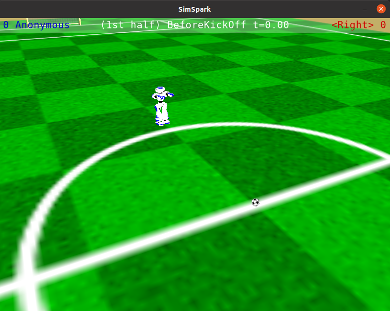
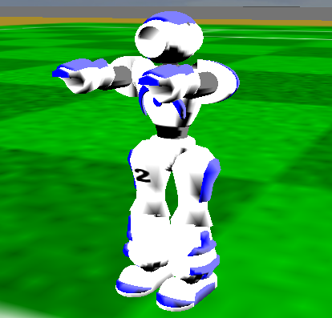

Running the Robot
#################

This is a tutorial on how to launch a simulated NAO robot in the SimSpark simulator using ROS2.

.. attention::

    This tutorial assumes that you have set up rcssserver3d on your computer. If you haven't done so already,
    go to `SimSpark's Gitlab`_ and follow the installation instructions.

.. attention::

    This tutorial assumes that you have built the packages in this repository and have sourced the setup file
    for the workspace you are in.

Starting the Simulator
**********************

In a terminal, start the simulator by running:

.. code-block:: console

    rcsoccersim3d
    

.. warning::

    Simulator tends to crash sometimes when connecting / disconnecting agents, which leaves unwanted
    server processes lingering. To kill this process, run ``pkill -9 rcssserver3d`` before restarting
    the simulation server.

Launching a Player
******************

In a new terminal, run:

.. code-block:: console

    ros2 run rcss3d_agent rcss3d_agent

You should see your robot in the rcssmonitor3d:

Print out Published Topics
**************************

Let's try and print out the visual ball information received by our simulated robot.
In a new terminal, run:

.. code-block:: console

    ros2 topic echo vision/ball

The terminal will start spamming information that looks like below:

.. code-block:: console

    header:
    stamp:
        sec: 1621042538
        nanosec: 632577496
    frame_id: CameraTop_frame
    point:
    x: 2.4840080627559
    y: 0.29839877333321424
    z: -0.4931144624222307
    ---

To visualise other topics that can be echoed are listed in :ref:`published-topics`.
By writing a subscriber that subccribes to any of the topic, you can access this informaion from your own package.

Moving the Robot's Joints
*************************

To send a joint command to the simulated robot, you must publish `nao_command_msgs/msg/JointPositions`_ data
to the ``effectors/joint_positions`` topic:

Let's try and move the HeadYaw joint so that the robot face 90 degrees left. To do so, we publish an array of joint
angles, and specify 1.57 radians (90 degrees) for the HeadYaw joint.

In a new terminal, run:

.. code-block:: console

    ros2 topic pub --once /effectors/joint_positions nao_command_msgs/msg/JointPositions '{indexes:{0}, positions:{1.57}}'

In the simulation monitor, you should see the robot with its head twisted.

.. note::
    
    See `joint_indexes`_ to see which joint corresponds to each index of the float array published in the previous message.

.. tip::

    Spend a bit of time playing around with the angles for each joint if you are not familiar with
    the NAO's joints!

Summary
*******

That's it! You should by now know how to 

* start up a simulated robot
* access sensory data
* and send joint position commands

.. _SimSpark's Gitlab: https://gitlab.com/robocup-sim/SimSpark/-/wikis/home
.. _nao_command_msgs/msg/JointPositions: https://nao-interfaces-docs.readthedocs.io/en/latest/command-msgs.html#jointpositions
.. _joint_indexes: https://nao-interfaces-docs.readthedocs.io/en/latest/joints.html#joint-indexes